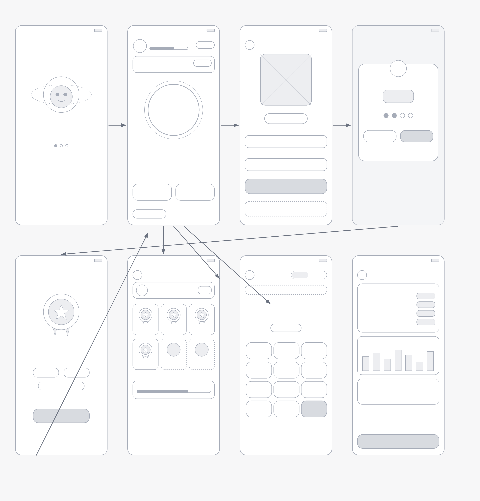

# GlicoKids: Gamified Diabetes Management (MVP Prototype)

## 1. Project Overview
**GlicoKids** is a native Android application designed for the gamified management of Type 1 Diabetes in children. It serves as an intelligent assistant that simplifies daily carbohydrate counting through visual plate estimation. Beyond insulin dosage calculation, the app features a gamification ecosystem designed to encourage physical activity, promoting overall health and reducing sedentary screen time.

## 2. Problem Statement
Managing Type 1 Diabetes in childhood requires constant mathematical calculations for carbohydrates and insulin dosages at every meal. Errors in this process can lead to severe hypoglycemia or hyperglycemia. GlicoKids alleviates the mental burden on parents and boosts child engagement by offering safe calculations and transforming care routines into a rewarding RPG-style adventure.

## 3. Technology Stack
- **Language**: Kotlin
- **UI Framework**: XML with ViewBinding (Material 3)
- **Architecture**: MVVM with Clean Architecture
- **Dependency Injection**: Hilt
- **Database**: Room (Local-first persistence)
- **Navigation**: Navigation Component & Intents

## 4. User Experience (UX)
*   **Child Interface (Primary UI)**: Playful, colorful, and reward-focused. Features a central "Meal Mission" (photo capture), achievement panels (badges and XP), and daily challenges.
*   **Parent Interface (Admin Panel)**: Password/PIN protected area where clinical parameters (Sensitivity Factor, Carb Ratio, Target Glucose) are configured and history is reviewed.

## 5. Design & UX Architecture
The design follows Google's Material Design guidelines, focused on cognitive accessibility for children. 

### Wireframe Flow

*The interface transitions between a dark "Space Station" theme for children and a clean, sober theme for parents.*

## 6. Technical Roadmap & Development History

### Phase 1: Infrastructure & Navigation (Module 2)
- **Core Architecture**: Establishment of Clean Architecture layers (Data, Domain, Presentation).
- **Navigation Strategy**: Implementation of Activity-to-Activity flows via `Intents` and `Extras` for data passing.
- **Security Baseline**: Mandatory `AlertDialog` for medical disclaimers on startup.
- **Lifecycle Management**: Detailed logging and management of `onCreate`, `onStart`, `onResume`, `onPause`, `onStop`, and `onDestroy`.

### Phase 2: Data Capture & Business Logic (Module 3)
- **Structured UI**: Responsive layouts using `ScrollView` as root to ensure keyboard compatibility.
- **Data Capture**: Specialized `EditText` components with specific `inputType` (Decimal/Numeric) for safe data entry.
- **Resilient Calculation**: Implementation of the "Hero's Bolus" logic: `(carbs/15) + (glucose-100)/50`, rounded down for safety.
- **Interactive States**: Use of `ViewBinding` for real-time validation and dynamic result display.
- **Design System Integration**: Application of the "Space Station" design tokens (Colors, 3D Buttons, Glass Cards).

### Phase 3: Advanced UI & Interaction (Module 4)
- **Dynamic Gallery**: Implementation of a `GridView` with a `BaseAdapter` to display earned medals.
- **Contextual Actions**: Usage of **Context Menus** (Long-press) on gallery items for "View Details" and "Share" features.
- **Image Switching**: Implementation of an `ImageSwitcher` with factory and animations for avatar selection.
- **External Integration**: Usage of a themed **WebView** with JavaScript enabled to display official health guidelines.
- **Global Navigation**: Implementation of an **Options Menu** (Toolbar) for quick access to app sections.
- **Helper Pattern**: Centralization of common UI logic in a `UIHelper` utility class.
- **Persistence**: Usage of `SharedPreferences` to save and restore user avatar preferences.

## 7. Quality Assurance & DevOps
- **Gitflow Strategy**: Professional branch structure (`main`, `staging`, `develop`).
- **CI/CD Pipeline**: GitHub Actions configured for automated build validation and JUnit testing on every Pull Request.
- **Branch Protection**: Strict rules and bypass lists implemented to ensure code integrity.

## 8. Test Credentials (Prototype Only)
To evaluate the prototype, use the following mocked credentials:
- **Parent Area PIN**: `1234`
- **Simulated Child Name**: `Lucas`

---
*This project is a technical prototype developed for academic purposes.*
